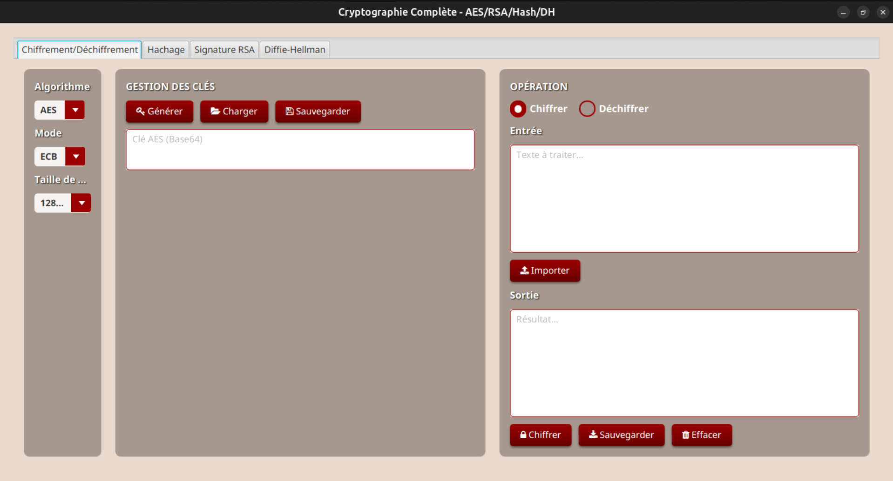

# 🔐 CryptoImpl — Application de Cryptographie AES/RSA

Application **JavaFX** de cryptographie permettant de chiffrer, déchiffrer, signer et vérifier des messages avec les algorithmes **AES** et **RSA**, avec une interface graphique thème rouge-noir et gestion complète des clés.

> TP de Cryptographie — Master 1 TDSI  
> Université Cheikh Anta Diop de Dakar — Laboratoire LACGAA

---

## 📸 Aperçu



---

## ✨ Fonctionnalités

### 🔑 Algorithmes supportés

#### AES — Chiffrement symétrique
| Taille de clé | Modes supportés |
|---------------|-----------------|
| 128 bits      | ECB, CBC        |
| 192 bits      | ECB, CBC        |
| 256 bits      | ECB, CBC        |

- Mode **ECB** (Electronic Codebook) — chiffrement bloc par bloc
- Mode **CBC** (Cipher Block Chaining) — avec génération automatique d'IV aléatoire

#### RSA — Chiffrement asymétrique
| Taille de clé | Padding supportés |
|---------------|-------------------|
| 1024 bits     | PKCS1, OAEP       |
| 2048 bits     | PKCS1, OAEP       |
| 4096 bits     | PKCS1, OAEP       |

- **PKCS1Padding** — mode standard
- **OAEPPadding** — mode renforcé, plus sécurisé

---

### ⚙️ Opérations disponibles

| Opération             | AES | RSA |
|-----------------------|-----|-----|
| 🔒 Chiffrer           | ✅   | ✅   |
| 🔓 Déchiffrer         | ✅   | ✅   |
| ✍️ Signer             | ❌   | ✅   |
| ✔️ Vérifier signature | ❌   | ✅   |

### 🗝️ Gestion des clés
- **Génération** de clés selon la taille choisie
- **Sauvegarde** en fichier `.txt` (format Base64)
- **Chargement** depuis fichier
- **RSA spécifique** : gestion séparée clé publique / clé privée / paire complète
- **Affichage visuel** des clés en Base64 dans l'interface

### ✍️ Signature numérique RSA
- Algorithme : **SHA256withRSA**
- Signature avec la **clé privée** → hash SHA-256 du message chiffré
- Vérification avec la **clé publique** → résultat **✓ VALIDE** ou **✗ INVALIDE**

### 📁 Gestion des fichiers
- Import de texte depuis `.txt`
- Export du résultat avec **noms intelligents** :
  ```
  AES_Key_CBC_256bits.txt
  RSA_PublicKey_2048bits.txt
  Encrypted_AES_ECB_128bits.txt
  Signature_RSA_2048bits.txt
  ```

### 🛡️ Sécurité des erreurs
Conformément aux exigences du TP, les messages d'erreur ne révèlent jamais de détails techniques :
- ❌ Pas de stack traces visibles
- ❌ Pas de noms de classes Java (`javax.crypto.BadPaddingException`...)
- ✅ Messages en **français** clairs et utiles
- ✅ Logs techniques uniquement en **console développeur**

---

## 🏗️ Architecture

```
org.example/
├── App.java                      # Interface JavaFX (FXML)
├── Main.java                     # Point d'entrée
├── logic/
│   └── CryptoService.java        # Logique métier centrale
└── crypto/
    ├── Icrypto.java              # Interface commune (polymorphisme)
    ├── CryptoType.java           # Enum : AES | RSA
    ├── CryptoMode.java           # Enum : ECB | CBC
    ├── KeySize.java              # Enum : tailles de clés
    ├── CryptoFactory.java        # Factory pattern
    ├── HashAlgorithm.java        # Enum algorithmes de hachage
    ├── aes/
    │   └── CryptoAES.java        # Implémentation AES (ECB + CBC + IV)
    ├── rsa/
    │   └── CryptoRSA.java        # Implémentation RSA + Signature
    ├── hash/
    │   └── HashService.java      # MD5, SHA-1, SHA-256, SHA-512
    └── dh/
        └── DiffieHellmanService.java  # Échange de clés Diffie-Hellman
```

### Patterns utilisés
- **Interface `Icrypto`** → polymorphisme AES/RSA
- **Factory pattern** → `CryptoFactory` instancie le bon algorithme
- **Enum** → typage fort pour modes, tailles, algorithmes

---

## 🛠️ Stack technique

| Technologie       | Usage                         |
|-------------------|-------------------------------|
| Java 17+          | Langage principal             |
| JavaFX            | Interface graphique           |
| `javax.crypto`    | Chiffrement AES               |
| `java.security`   | Chiffrement RSA + Signatures  |
| Base64            | Encodage des données binaires |
| FontAwesome (TTF) | Icônes des boutons            |
| Maven             | Gestion des dépendances       |

---

## 🚀 Installation & Démarrage

### Prérequis
- Java 17 ou supérieur
- Maven 3.8+
- JavaFX SDK

### 1. Cloner le projet
```bash
git clone https://github.com/alassanelayediop/CryptoImpl.git
cd CryptoImpl
```

### 2. Compiler
```bash
mvn clean install
```

### 3. Lancer
```bash
mvn javafx:run
```

Ou depuis IntelliJ IDEA : ouvrir le projet → clic droit sur `Main.java` → **Run**.

---

## 🔬 Détails techniques

### AES — Mode CBC
```
Chiffrement :
  IV aléatoire (16 bytes) généré à chaque opération
  Données chiffrées = [IV (16 bytes)] + [Cipher (n bytes)]

Déchiffrement :
  Extraction des 16 premiers bytes → IV
  Déchiffrement du reste avec l'IV extrait
```

### RSA — Limitation de taille
```
RSA 1024 bits → max ~117 bytes en clair
RSA 2048 bits → max ~245 bytes en clair
RSA 4096 bits → max ~501 bytes en clair

Pour les gros messages → chiffrement hybride :
  AES chiffre les données + RSA chiffre la clé AES
```

### Signature numérique
```
Signer :
  1. Hash SHA-256 du message
  2. Chiffrement du hash avec la clé privée RSA
  → Résultat : signature en Base64

Vérifier :
  1. Hash SHA-256 du message original
  2. Déchiffrement de la signature avec la clé publique
  3. Comparaison des deux hash → VALIDE ou INVALIDE
```

---

## 📝 Scénarios d'utilisation

### Scénario 1 — Chiffrement AES CBC
1. Sélectionner **AES** → mode **CBC** → taille **256 bits**
2. Cliquer **"Générer une clé"** → sauvegarder la clé
3. Saisir le texte clair dans la zone d'entrée
4. Cliquer **"Chiffrer"** → résultat en Base64
5. Sauvegarder le texte chiffré (`Encrypted_AES_CBC_256bits.txt`)

### Scénario 2 — Signature RSA
1. Sélectionner **RSA** → taille **2048 bits**
2. Générer la paire de clés → sauvegarder clé privée
3. Mode **"Signer"** → saisir le message
4. Cliquer **"Signer"** → signature en Base64
5. Sauvegarder la signature et la clé publique

### Scénario 3 — Vérification de signature
1. Charger la **clé publique** du signataire
2. Mode **"Vérifier"** → saisir le message original
3. Charger ou coller la **signature**
4. Cliquer **"Vérifier"** → **✓ VALIDE** ou **✗ INVALIDE**

---

## 👨‍💻 Auteur

**Alassane Laye Diop**  
Étudiant en Master 1 TDSI — Université Cheikh Anta Diop de Dakar  
[GitHub](https://github.com/alassanelayediop) • [LinkedIn](https://www.linkedin.com/in/alassane-laye-diop-0a6a57270)
